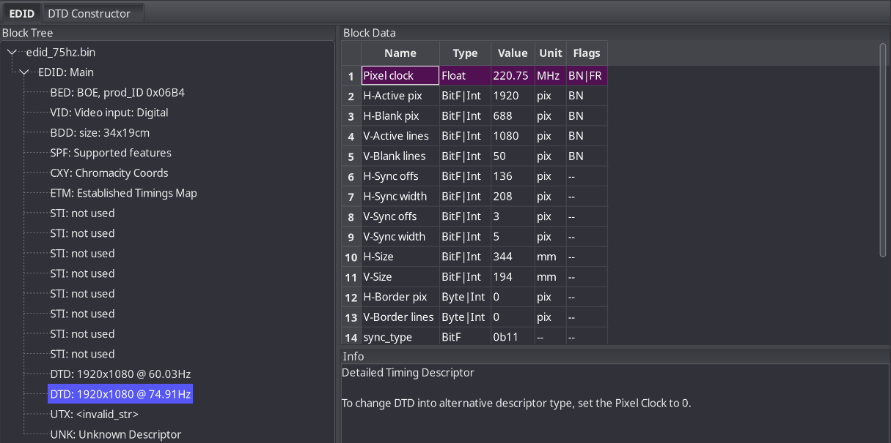

<div align="center">

# EDID-Overclock
**Custom EDID firmware profile**    

[](https://github.com/louzkk/edid-overclock)
[](LICENSE)
[](https://discord.gg/QJPdw2UrVt)
[](https://github.com/louzkk/edid-overclock/releases)

</div>

A shell script that installs a custom EDID firmware on Linux, enabling monitor refresh rate overclocking beyond what the panel advertises. Handles initramfs embedding, kernel parameter injection, and bootloader configuration automatically.      

**Tested on my PC:** UHD 620, BOE 1920x1080, 60hz and CachyOS (Wayland)     
**Requirements:** mkinitcpio, wxEDID and GRUB.     

its not that hard, I promise      

---

## Guide
> Replace `75`, `edid_75hz.bin` `card-eDPI-1` and `eDP-1` with your target refresh rate/resolution, file name and output name.

**1. Find your display output name**
```bash
ls /sys/class/drm/
```

**2. Extract your current EDID**
```bash
cat /sys/class/drm/card1-eDP-1/edid > edid_original.bin
```

**3. Calculate the new timings**
```bash
cvt 1920 1080 75
```

**4. Edit the EDID in wxEDID**
Open `edid_original.bin` in wxEDID and find the DTD you want to replace (e.g. the 48Hz one). Set the new timings from the cvt output. Mind sync polarity: CVT outputs `-hsync +vsync`, make sure wxEDID matches that. Save as `edid_75hz.bin`.



**5. Install**
```bash
chmod +x edid-apply.sh
sudo ./edid-apply.sh install edid_75hz.bin eDP-1
```

If your bootloader wasn't detected
```bash
sudo ./edid-apply.sh install edid_75hz.bin eDP-1 --bootloader systemd-boot
```

**6. Reboot and verify**
```bash
kscreen-doctor -o
```
Your target refresh rate/resolution should now appear in the list.

---

## Removing
```bash
sudo ./edid-apply.sh remove edid_75hz.bin
```

---

## Notes
- Black screens are usually caused by wrong sync polarity, not the pixel clock being too high — eDP panels often accept much higher clocks than their EDID advertises
- If you get a black screen after rebooting, edit the bootloader entry at boot time (press `e` in GRUB), remove the `drm.edid_firmware=...` parameter and boot. Then run the remove command above
- This script modifies the EDID reported to your system. **Use at your own risk.** I'm not responsible for any instability or damage.

---

<div align="center">
Maintained by: <a href="https://github.com/louzkk">louzkk 🇧🇷</a>
</div>
